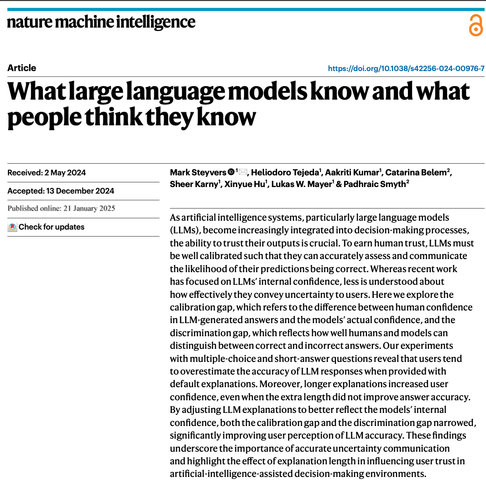
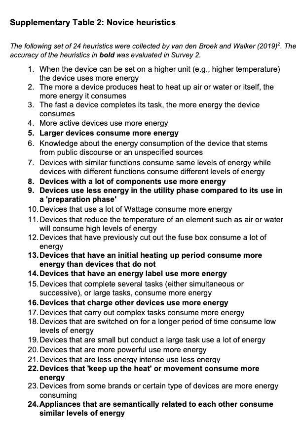
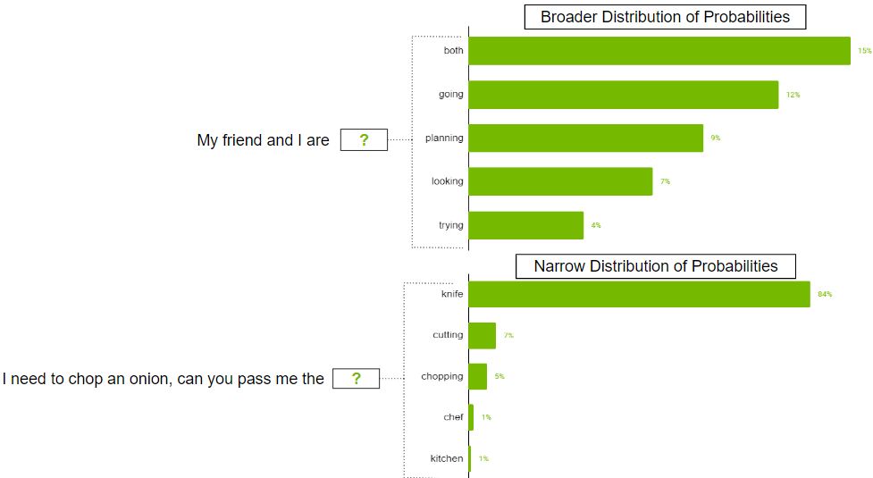
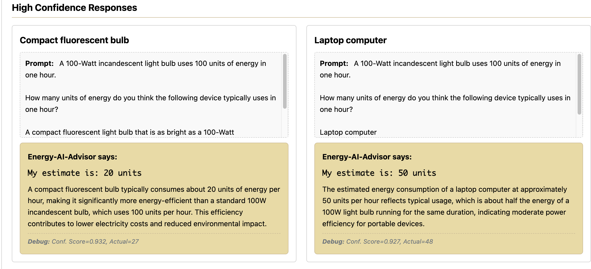

# Calibrating Trust in an LLM Energy Advisor
Thomas E. Gorman, Torsten Reimer

## Background

#### Energy Knowledge

#### LLM Uncertainty

Attari et al. (2010) Steyvers et al. (2025)

## Attari et al. (2010)

- Estimation Task
- Compression pattern. Underestimation of high-energy appliances and
  overestimation of low-energy items.
- Some evidence suggesting that the effect occurs due to people using
  unreliable heuristics when making estimates - e.g,. a size heuristic
  (thinking that larger appliances use more energy)

Attari et al. (2010)

## Estimation Task

- Participants given a reference point (100 W lightbulb) and asked to
  estimate the energy use of various household appliances.

## Anchor Influence

- Results can vary depending on the anchor used.
- Frederick et al. (2011) used the original Attari et al. (2010) anchor
  (100 W lightbulb), along with smaller flashlight bulb, and larger
  electric furnace

## Cues and Heuristics

- Schille-Hudson et al. (2019) examined relationship between energy
  estimation ability, and reliance on various observable appliance
  features.

## Cues and Heuristics

#### Novice Heuristics

#### Expert Heuristics (subset)

Kantenbacher & Attari (2021)

## Steyvers et al. (2025)

- LLM’s tend to use confident language, even when they are uncertain.
- The expressed confidence of the LLM is not always aligned with the
  internal confidence of the model.

## LLM confidence from output layer probabilities

Image from
[https://developer.nvidia.com/blog](https://developer.nvidia.com/blog/how-to-get-better-outputs-from-your-large-language-model/)

## Steyvers et al. (2025)

Steyvers et al. (2025)

## Energy AI Tasks

#### Task from Attari et al. (2010)

- Estimate energy of each item
- No AI Assistance

#### Procedure choices

- See all items at once, or one at a time
- Anchor
- Feedback

## Energy AI Tasks

#### Procedure choices

- AI Portrayal
  - Energy Advisor?
  - ChatGPT response?
  - Another human participant?

## Energy AI Tasks

## Energy AI Task LLM Explanations

## Energy AI Task LLM Explanations

<iframe width="1200" height="600" src="https://tegorman13.github.io/llm_energy_task/task/task_dash.html" title="Webpage example"></iframe>

## References

Attari, S. Z., DeKay, M. L., Davidson, C. I., & Bruine De Bruin, W.
(2010). Public perceptions of energy consumption and savings.
*Proceedings of the National Academy of Sciences*, *107*(37),
16054–16059. <https://doi.org/10.1073/pnas.1001509107>

Frederick, S. W., Meyer, A. B., & Mochon, D. (2011). Characterizing
perceptions of energy consumption. *Proceedings of the National Academy
of Sciences*, *108*(8), E23–E23.
<https://doi.org/10.1073/pnas.1014806108>

Kantenbacher, J., & Attari, S. Z. (2021). Better rules for judging
joules: Exploring how experts make decisions about household energy use.
*Energy Research & Social Science*, *73*, 101911.
<https://doi.org/10.1016/j.erss.2021.101911>

Schille-Hudson, E. B., Margehtis, T., Miniard, D., Landy, D., & Attari,
S. Z. (2019). Big, hot, or bright? Integrating cues to perceive home
energy use. *Proceedings of the Annual Meeting of the Cognitive Science
Society*, *41*. <https://escholarship.org/uc/item/83z4w09n>

Steyvers, M., Tejeda, H., Kumar, A., Belem, C., Karny, S., Hu, X.,
Mayer, L., & Smyth, P. (2025). What large language models know and what
people think they know. *Nature Machine Intelligence*, 1–11.
<https://doi.org/10.1038/s42256-024-00976-7>

## extra

## Attari et al. (2010)

| Appliance | Actual Use (W) | Median Human Estimate (W) | Human Error Factor |
|----|---:|---:|---:|
| Laptop computer | 48 W | 200 W | **4.2×** (overestimate) |
| Stereo system | 128 W | 125 W | 0.98× (very accurate) |
| Desktop computer | 140 W | 340 W | **2.4×** (overestimate) |
| Portable heater | 925 W | 500 W | **0.54×** (underestimate) |
| Room A/C unit | 1,000 W | 500 W | **0.50×** (underestimate) |
| Dishwasher | 1,800 W | 300 W | **0.17×** (underestimate) |
| Clothes dryer | 3,400 W | 500 W | **0.15×** (underestimate) |
| Central A/C | 3,500 W | 800 W | **0.23×** (underestimate) |

higher or lower variability can of course vary greatly between domains

One common manipulation in visuomotor learning is to have a group train
with the lowest possible variability - constant

This is a fairly common pattern, at least to my reading. But….,

